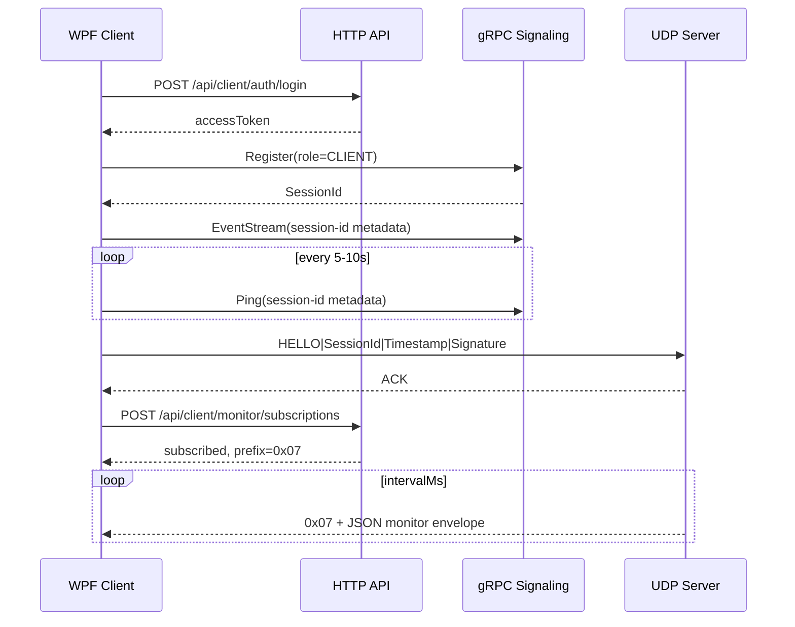

# WPF / 上位机客户端接入指南

本文档面向 **WPF / 上位机 / 网站本地代理** 这类 `CLIENT` 角色客户端，覆盖两类能力：

- 控制面：HTTP 登录、设备列表、gRPC 注册、心跳、媒体订阅、EventStream 事件接收。
- 监控面：HTTP 管理订阅，客户端通过 UDP 接收服务端自产的高频监控数据 `0x07`。

当前系统不再提供 SSE 监控流。低频信息通过 HTTP 拉取，高频监控信息通过 UDP 推送。

---

## 1. 客户端角色

WPF / 上位机客户端应以 gRPC `CLIENT` 角色注册：

```csharp
var reg = await client.RegisterAsync(new RegisterRequest
{
    Token = token,
    Role = RegisterRequest.Types.EndpointType.Client,
    DeviceId = "wpf-monitor-01",
    RobotGeneration = 0,
    VrVersion = string.Empty
});
```

注册成功后得到：

- `SessionId`：后续 gRPC metadata、UDP HELLO/PING 签名密钥、监控订阅目标。
- `ClientIp` / `ClientPort`：用于显示和排障，不等价于 UDP endpoint。

`device_id` 当前主要用于展示，不能作为权限判断依据。监控订阅权限由现有 admin bearer token 控制。

---

## 2. HTTP 登录与管理权限

客户端管理接口走 HTTP admin bearer token。

### POST /api/client/auth/login

请求体：

```json
{
  "username": "admin",
  "password": "Admin!20260523"
}
```

返回字段：

- `tokenType`
- `accessToken`
- `expiresUtc`
- `user.username`
- `user.role`

后续 HTTP 管理请求添加：

```http
Authorization: Bearer <accessToken>
```

---

## 3. 设备列表

当前提供三个 admin 设备列表接口：

- `GET /api/client/devices/robots?onlineOnly=true`
- `GET /api/client/devices/vrs?onlineOnly=true`
- `GET /api/client/devices/clients?onlineOnly=true`

返回项包含：

- `sessionId`
- `deviceId`
- `role`
- `robotGeneration`
- `vrVersion`
- `online`
- `pushConnected`
- `hasUdpEndpoint`
- `pairedSessionId`

媒体订阅时，通常从 robots 列表中取目标机器人的 `sessionId` 作为 `Subscribe.publisher_session_id`。

---

## 4. gRPC Metadata

`Register` 成功后，后续所有 gRPC 调用都必须携带 metadata：

```csharp
var headers = new Metadata
{
    { "session-id", reg.SessionId }
};
```

如果不带 `session-id`：

- `Ping` 无法刷新在线状态。
- `Subscribe` 无法绑定订阅者。
- `EventStream` 无法稳定绑定到客户端会话。

---

## 5. 推荐启动顺序

控制面与监控面完整启动顺序：

1. HTTP `POST /api/client/auth/login` 获取 admin bearer token。
2. gRPC `Register(role=CLIENT)` 获取 `SessionId`。
3. 建立 gRPC metadata：`session-id = SessionId`。
4. 启动 gRPC `Ping` 心跳。
5. 打开 gRPC `EventStream`。
6. 向服务端 UDP 端口发送 `HELLO|SessionId|Timestamp|Signature`，建立 UDP endpoint。
7. 如需高频监控，HTTP `POST /api/client/monitor/subscriptions` 创建监控订阅。
8. 按需 HTTP 拉取设备列表，选择机器人后调用 gRPC `Subscribe` 订阅媒体/配置相关信息。



---

## 6. 心跳与事件流

### Ping

建议每 `5s ~ 10s` 调一次 gRPC `Ping`，明显小于当前 30 秒在线窗口。

```csharp
await client.PingAsync(new Heartbeat
{
    ClientTime = DateTimeOffset.UtcNow.ToUnixTimeMilliseconds()
}, headers);
```

### EventStream

WPF 客户端应尽早建立 `EventStream`，用于控制面下行事件：

- 配对事件
- 系统指令
- 视频配置事件
- 音频配置事件

```csharp
using var call = client.EventStream(new EventSubscribe
{
    SessionId = reg.SessionId
}, headers);

await foreach (var evt in call.ResponseStream.ReadAllAsync(cancellationToken))
{
    switch (evt.PayloadCase)
    {
        case EventMessage.PayloadOneofCase.VideoConfig:
            break;
        case EventMessage.PayloadOneofCase.AudioConfig:
            break;
        case EventMessage.PayloadOneofCase.System:
            break;
    }
}
```

---

## 7. UDP endpoint 绑定

如果客户端要接收 UDP 数据，包括系统监控 `0x07`，必须先完成 UDP endpoint 绑定。

### HELLO

```text
HELLO|SessionId|Timestamp|Signature
```

### PING

```text
PING|SessionId|Timestamp|Signature
```

签名规则：

- `Key = SessionId`
- `Data = Type + SessionId + Timestamp`
- `Signature = HMACSHA256(Key, Data)`，转小写 hex

示例：

```csharp
static string SignUdpControl(string type, string sessionId, long timestampSeconds)
{
    var data = type + sessionId + timestampSeconds.ToString(CultureInfo.InvariantCulture);
    using var hmac = new HMACSHA256(Encoding.UTF8.GetBytes(sessionId));
    return Convert.ToHexString(hmac.ComputeHash(Encoding.UTF8.GetBytes(data))).ToLowerInvariant();
}
```

客户端行为建议：

- gRPC 注册成功后立即发送 `HELLO`。
- 收到 `ACK` 表示服务端已绑定当前 UDP endpoint。
- 空闲时每 5 秒左右发送 `PING` 维持 NAT 映射。
- 超过 15 秒没有收到任意服务端 UDP 回包时，立即重发 `HELLO`。

服务端只用验签通过的 `HELLO/PING` 更新 UDP endpoint；普通数据包不会更新 endpoint。

---

## 8. 高频监控订阅

高频监控由 HTTP 控制订阅，UDP 数据面推送。订阅操作必须使用 admin bearer token，且目标 `subscriberSessionId` 必须已经存在并拥有 UDP endpoint。

### POST /api/client/monitor/subscriptions

```http
Authorization: Bearer <accessToken>
```

```json
{
  "subscriberSessionId": "client-session-id",
  "topics": ["udp_global", "signaling_rates", "online_summary", "runtime_tables"],
  "intervalMs": 1000
}
```

校验规则：

- admin bearer token 必须有效。
- `subscriberSessionId` 必须存在。
- 该 session 必须已有 UDP endpoint；否则返回 `409 Conflict`。
- `intervalMs` 范围为 `250..10000`，默认 `1000`。

支持 topic：

- `udp_global`：UDP 全局 rx/tx/txOk/txFail/retry/drop 快照。
- `signaling_rates`：gRPC/WS 信令收发速率和累计值。
- `online_summary`：服务端视角的注册数、在线数、按角色在线数、推送通道连通数。
- `runtime_tables`：后端运行时会话表、配对表、转发表、反馈路由等内部表数量快照。

成功响应：

```json
{
  "success": true,
  "message": "Subscribed",
  "publisherSessionId": "system:monitor",
  "subscriberSessionId": "client-session-id",
  "udpEndpoint": "192.168.1.20:52000",
  "prefix": "0x07",
  "topics": ["udp_global", "signaling_rates", "online_summary", "runtime_tables"],
  "effectiveIntervalMs": 1000
}
```

其它接口：

- `GET /api/client/monitor/subscriptions`
- `DELETE /api/client/monitor/subscriptions/{subscriberSessionId}`

---

## 9. UDP 0x07 监控包

服务端系统自产 UDP 数据从 `0x07` 开始；`0x05` 和 `0x06` 已预留给其它用途。

监控包格式：

```text
[0x07][UTF-8 JSON envelope]
```

JSON envelope 字段：

- `sequence`：针对该订阅目标递增的序号。
- `serverTimeUnixMs`：服务端发送时间。
- `publisherSessionId`：固定为 `system:monitor`。
- `targetSessionId`：订阅者 session。
- `prefix`：固定为 `0x07`。
- `topics`：本包携带的 topic 名称。
- `udp`：订阅 `udp_global` 时出现。
- `signaling`：订阅 `signaling_rates` 时出现。
- `online`：订阅 `online_summary` 时出现。
- `runtimeTables`：订阅 `runtime_tables` 时出现。

接收示例：

```csharp
var result = await udpClient.ReceiveAsync(cancellationToken);

if (result.Buffer.Length > 1 && result.Buffer[0] == 0x07)
{
    var json = Encoding.UTF8.GetString(result.Buffer, 1, result.Buffer.Length - 1);
    // 反序列化 JSON envelope，按 topics 分发到监控视图
}
```

`sequence` 可用于检测丢包或乱序。监控 UDP 包是高频可丢数据，不要求可靠重传。

---

## 10. 低频监控 HTTP 拉取

低频页面、调试工具或启动阶段可继续使用 HTTP 拉取：

- `GET /api/monitor/udp/stats`
- `GET /api/monitor/system/stats`
- `GET /api/monitor/sessions`
- `GET /api/monitor/sessions/{sessionId}`
- `GET /api/system/config`

其中 `/api/monitor/udp/stats` 默认仅在 Development 环境启用；非 Development 需要配置 `Monitoring:Enabled=true`。

---

## 11. 媒体订阅

WPF 客户端不需要配对，也可以直接订阅某个机器人发布者。

```csharp
await client.SubscribeAsync(new SubscribeRequest
{
    Op = SubscribeRequest.Types.Operation.Subscribe,
    PublisherSessionId = robotSessionId,
    SubVideo = false,
    SubPose = true,
    SubAudio = true
}, headers);
```

取消订阅：

```csharp
await client.SubscribeAsync(new SubscribeRequest
{
    Op = SubscribeRequest.Types.Operation.Unsubscribe,
    PublisherSessionId = robotSessionId,
    SubVideo = false,
    SubPose = true,
    SubAudio = true
}, headers);
```

媒体订阅控制的是机器人/VR/客户端之间的媒体发布者与订阅者关系；系统监控订阅的发布者固定为 `system:monitor`，由 HTTP admin 接口控制。

---

## 12. 最小启动骨架

```csharp
var httpClient = new HttpClient { BaseAddress = new Uri(httpBaseAddress) };
var login = await httpClient.PostAsJsonAsync("/api/client/auth/login", new
{
    username = "admin",
    password = "Admin!20260523"
}, cancellationToken);

var auth = await login.Content.ReadFromJsonAsync<ClientLoginResult>(cancellationToken);
httpClient.DefaultRequestHeaders.Authorization = new AuthenticationHeaderValue("Bearer", auth!.AccessToken);

var channel = GrpcChannel.ForAddress(grpcAddress);
var client = new Signaling.SignalingClient(channel);

var reg = await client.RegisterAsync(new RegisterRequest
{
    Token = auth.AccessToken,
    Role = RegisterRequest.Types.EndpointType.Client,
    DeviceId = Environment.MachineName,
    RobotGeneration = 0,
    VrVersion = string.Empty
});

var headers = new Metadata { { "session-id", reg.SessionId } };

_ = Task.Run(() => StartHeartbeatLoopAsync(client, headers, cancellationToken));
_ = Task.Run(() => StartEventLoopAsync(client, reg.SessionId, headers, cancellationToken));
_ = Task.Run(() => StartUdpReceiveLoopAsync(reg.SessionId, cancellationToken));

await SendUdpHelloAsync(reg.SessionId, cancellationToken);

await httpClient.PostAsJsonAsync("/api/client/monitor/subscriptions", new
{
    subscriberSessionId = reg.SessionId,
    topics = new[] { "udp_global", "signaling_rates" },
    intervalMs = 1000
}, cancellationToken);
```

---

## 13. 本地模块划分建议

- `ClientAuthApi`
  - 负责 HTTP 登录和 bearer token 管理。
- `GrpcSessionClient`
  - 负责 `Register / Ping / Subscribe / EventStream`。
- `UdpEndpointClient`
  - 负责 UDP `HELLO/PING`、ACK/PONG/DACK、`0x07` 接收。
- `MonitorSubscriptionApi`
  - 负责 HTTP 创建/删除系统监控订阅。
- `RobotDirectoryService`
  - 负责 HTTP 获取机器人/VR/客户端列表。
- `EventDispatchService`
  - 负责把 EventStream 和 UDP 监控包分发到 ViewModel。

---

## 14. 第一版建议避免的事情

- 不调用 `Pair` 参与机器人/VR 配对流程。
- 不调用 `ListUnpaired` 作为设备目录。
- 不调用 `GetP2pInfo` 建立 P2P 路径。
- 不把高频监控塞进 gRPC `EventStream`。
- 不依赖 `device_id` 做权限判断。

WPF 客户端的稳定边界是：以 `CLIENT` 会话接入，HTTP 负责管理权限与低频查询，gRPC 负责控制面事件，UDP 负责高频可丢监控数据。